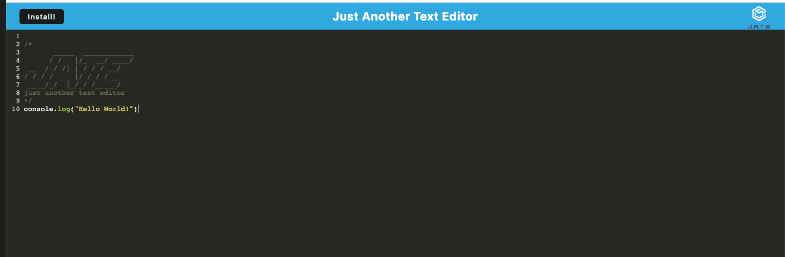

# Editing-Text
### Github : https://github.com/kevinl206/Editing-Text.git
### Heroku: https://boiling-tor-54130.herokuapp.com/

## Table of Contents
- [Description](#description)
- [Installation](#installation)
- [Github](#github)
- [Email](#email)
- [Questions](#questions)
  
## Description
    This text editor application is a Progressive Web Application (PWA) that runs in the browser and function offline. This application is deployed to Heroku.
[Back to top](#)
  
## Installation
- First thing, first. Clone the repo.
- Then Download and install "npm install" or "npm i".
- After the npm install, enter this command:
"npm run start:dev"
- Next to run the application:
"npm run start"
- After running the application you will need to open the application in your browser at localhost:3001
 

[Back to top](#)
  
## Screenshot of Example

[Back to top](#)
  
 ## Email
      kevinl206@yahoo.com
[Back to top](#)
  
## Questions
  any additional questions, feel free to reach out to me via [email](mailto:kevinl206@yahoo.com).